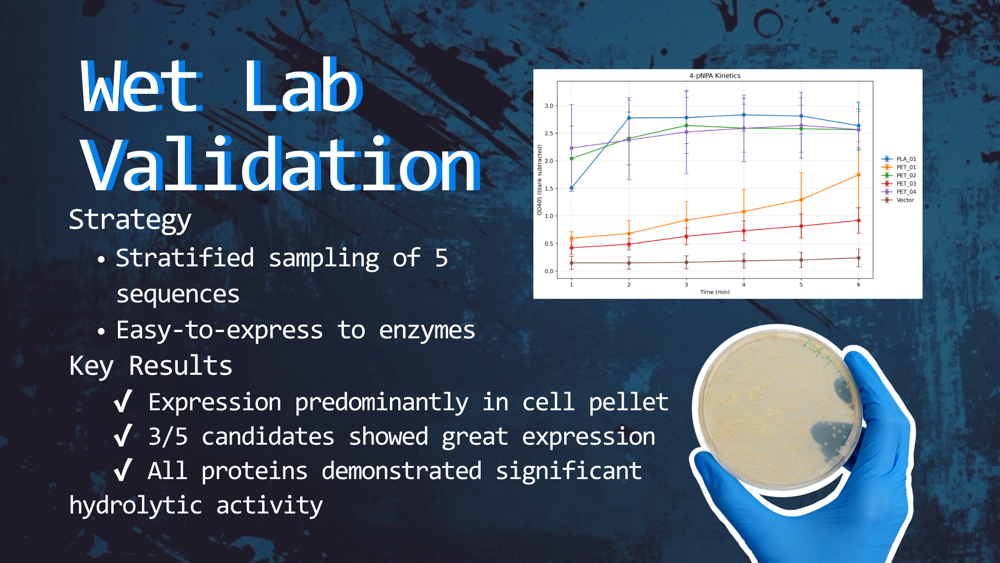
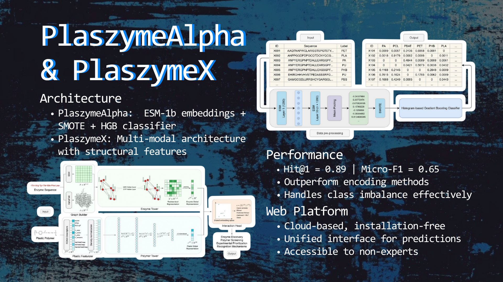
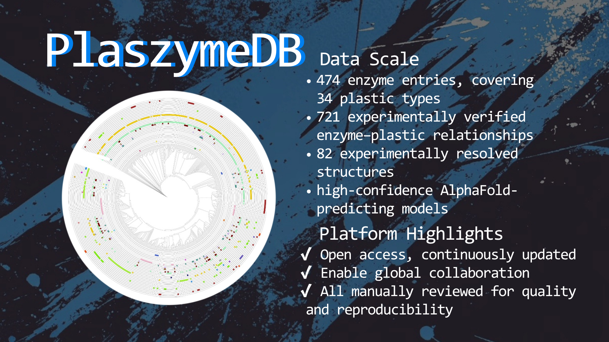
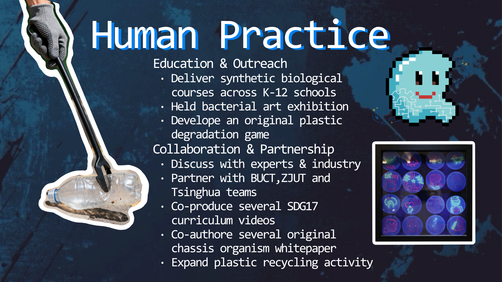

# PlaszymeDB - Comprehensive Plastic-Degrading Enzyme Platform

## Project Overview

PlaszymeDB is a comprehensive plastic-degrading enzyme prediction and analysis platform that provides researchers worldwide with a complete toolchain from sequence prediction to structural analysis, from database search to phylogenetic analysis.

### 📹 Demo Videos 

<div align="center">

### 🎬 PlaszymeDB & PlaszymeModel Demo

<video src="https://github.com/Yolo24max/Plastic-Degrading-Enzyme-Database-and-Modeling-Platform/raw/main/demo/plaszymeDB_and_plaszymeModel.mp4" controls="controls" style="max-width: 730px;">
Your browser does not support the video tag.
</video>

[📥 Download PlaszymeDB & PlaszymeModel Demo](https://github.com/Yolo24max/Plastic-Degrading-Enzyme-Database-and-Modeling-Platform/raw/main/demo/plaszymeDB_and_plaszymeModel.mp4) | [🎬 Watch on Bilibili](https://www.bilibili.com/video/BV1kZsJzrES7/?vd_source=9b1d8c517682332c668a3fdc310aaae9)

---

### 🎬 PlaszymeDB Demo

<video src="https://github.com/Yolo24max/Plastic-Degrading-Enzyme-Database-and-Modeling-Platform/raw/main/demo/plaszymeDB.mp4" controls="controls" style="max-width: 730px;">
Your browser does not support the video tag.
</video>

[📥 Download PlaszymeDB Demo](https://github.com/Yolo24max/Plastic-Degrading-Enzyme-Database-and-Modeling-Platform/raw/main/demo/plaszymeDB.mp4) | [🎬 Watch on Bilibili](https://www.bilibili.com/video/BV1AZsJzkEvx/)

---

### 🎬 PlaszymeAlpha Demo

<video src="https://github.com/Yolo24max/Plastic-Degrading-Enzyme-Database-and-Modeling-Platform/raw/main/demo/plaszymeAlpha.mp4" controls="controls" style="max-width: 730px;">
Your browser does not support the video tag.
</video>

[📥 Download PlaszymeAlpha Demo](https://github.com/Yolo24max/Plastic-Degrading-Enzyme-Database-and-Modeling-Platform/raw/main/demo/plaszymeAlpha.mp4) | [🎬 Watch on Bilibili](https://www.bilibili.com/video/BV1rAsnzMEcS/?spm_id_from=333.1387.upload.video_card.click&vd_source=9b1d8c517682332c668a3fdc310aaae9)

---

### 🎬 PlaszymeX Demo

<video src="https://github.com/Yolo24max/Plastic-Degrading-Enzyme-Database-and-Modeling-Platform/raw/main/demo/plaszymeX.mp4" controls="controls" style="max-width: 730px;">
Your browser does not support the video tag.
</video>

[📥 Download PlaszymeX Demo](https://github.com/Yolo24max/Plastic-Degrading-Enzyme-Database-and-Modeling-Platform/raw/main/demo/plaszymeX.mp4) | [🎬 Watch on Bilibili](https://www.bilibili.com/video/BV1rAsnzMEcW/?spm_id_from=333.1387.upload.video_card.click&vd_source=9b1d8c517682332c668a3fdc310aaae9)

</div>

---






### Core Data
- **474** plastic-degrading enzymes
- **34** types of plastic polymers
- **Multi-model prediction** sequence + structure
- **3D structure visualization** predicted + experimental data

## System Architecture

### Core Components

| Component | Function | Tech Stack | Status |
|-----------|----------|------------|--------|
| **PlaszymeDB** | Database search and browse | PHP + MySQL + Apache | Production Ready |
| **PlaszymerV1** | Sequence prediction model | Flask + ESM + scikit-learn | Available |
| **PlaszymeX** | Structure prediction model | PyTorch + PyTorch Geometric | Beta |
| **ColabFold** | Structure prediction | AlphaFold2 | Integrated |

## Quick Start

### System Requirements
- **Python**: 3.9+ (recommended 3.11)
- **PHP**: 7.4+
- **MySQL**: 8.0+
- **Memory**: 8GB+ (recommended 16GB)
- **Storage**: 20GB+ (including ESM models)

### Installation Steps

```bash
# 1. Clone repository
git clone <repository-url>
cd plaszymedb

# 2. Database configuration
mysql -u root -p plaszymedb < plaszymedb_backup.sql

# 3. Install Python dependencies
python -m venv plaszyme_env
source plaszyme_env/bin/activate
pip install -r requirements.txt

# 4. Download ESM models
mkdir -p ~/.cache/torch/hub/checkpoints/
wget https://dl.fbaipublicfiles.com/fair-esm/models/esm1b_t33_650M_UR50S.pt \
     -O ~/.cache/torch/hub/checkpoints/esm1b_t33_650M_UR50S.pt
```

### Start Services

```bash
# Start web server
cd PlaszymerV1
python app_new.py

# Access http://localhost:5000
```

## Main Features

### Database Search
- **Full-text search**: Enzyme names, EC numbers, sequences, gene names
- **Advanced filtering**: Plastic types, EC classification, host organisms
- **3D structure viewing**: Interactive visualization based on Mol*
- **BLAST search**: Sequence similarity analysis
- **Phylogenetic analysis**: Evolutionary trees based on iTOL

### Sequence Prediction (V1 Model)
```python
from load_original_model import load_original_models, safe_predict
from utils import get_embeddings

# Load model
classifier, label_encoder = load_original_models()

# Prediction
sequence = "MTVRFVTGKPSE"
embeddings = get_embeddings([sequence])
result = safe_predict(classifier, label_encoder, embeddings)
```

### Structure Prediction (X1 Model)
```python
from plaszyme.scripts.predict_listwise import predict_from_pdb

# PDB file prediction
result = predict_from_pdb(
    pdb_path="protein.pdb",
    model_path="weights/gnn_bilinear/best_bilinear.pt",
    output_dir="results/"
)
```

### ColabFold Integration
```bash
# Predict 3D structure from sequence
colabfold_batch --use-gpu input.fasta output_dir/
```

## Model Performance

| Model | Input Type | Accuracy | Prediction Time |
|-------|------------|----------|-----------------|
| **V1** | Protein sequence | 85%+ | 2-5 seconds |
| **X1** | PDB structure | 90%+ | 5-10 seconds |
| **ColabFold** | Sequence→Structure | - | 2-10 minutes |

## API Interfaces

### Search Interface
```http
GET /search.php?search=keyword&plastic=PET&ec=3.1.1
```

### BLAST Search
```http
POST /blast_search.php
Content-Type: application/json

{
  "sequence": "ATCG...",
  "max_results": 25,
  "threshold": "medium"
}
```

### 3D Structure
```http
GET /api_protein_structure.php?plz_id=PLZ_ID&type=predicted&action=pdb
```

## Project Structure

```
plaszymedb/
├── deploy_package/           # Database system
│   ├── V9.html              # Main page
│   ├── search.php           # Search API
│   ├── blast_search.php     # BLAST API
│   └── pdb_predicted/       # Predicted structures
├── PlaszymerV1/             # V1 sequence prediction model
│   ├── app_new.py           # Flask server
│   ├── load_original_model.py
│   └── model/               # Pre-trained models
├── Plaszyme-1.0.0-beta/     # X1 structure prediction model
│   ├── src/plaszyme/        # GNN code
│   ├── weights/             # Model weights
│   └── data/plastics_sdf/   # Plastic molecule data
└── esm_models_temp/         # ESM pre-trained models
```

## Deployment Guide

### Local Deployment
```bash
# 1. Configure database
# Edit db_config.php
define('DB_HOST', 'localhost');
define('DB_NAME', 'plaszymedb');
define('DB_USER', 'your_username');
define('DB_PASS', 'your_password');

# 2. Start service
python app_new.py
```

### Server Deployment
```bash
# 1. System dependencies
sudo apt update
sudo apt install python3.11 python3.11-pip nginx mysql-server

# 2. Configure reverse proxy
sudo nano /etc/nginx/sites-available/plaszyme

# 3. Start service
sudo systemctl enable plaszyme
sudo systemctl start plaszyme
```

### AWS Deployment
```bash
# Use automated deployment script
cd deploy_scripts
./3_ec2_setup.sh
```

## Troubleshooting

### Common Issues
1. **CUDA memory insufficient**: Use CPU version
2. **ESM model loading failed**: Check model path
3. **502 proxy error**: Check service status

### Detailed Documentation
- `TROUBLESHOOT_502.md` - 502 error solutions
- `SERVER_DEPLOYMENT_GUIDE.md` - Server deployment guide
- `COLABFOLD_STEP_BY_STEP_GUIDE.md` - ColabFold integration guide

## User Guide

### Search Function
1. Enter keywords in search box (enzyme names, EC numbers, sequences, etc.)
2. Select filter conditions (plastic types, EC classification, etc.)
3. Click search to view results

### 3D Structure Viewing
1. Click "View Structure" in search results
2. Select data type (predicted/experimental)
3. Use Mol* viewer for interaction

### Data Download
- **Sequence data**: FASTA format
- **Structure data**: PDB format
- **Metadata**: CSV format

## Contributing

We welcome contributions from the scientific community:
- Report new plastic-degrading enzymes
- Provide structural data
- Report bugs or suggestions

## Contact

- **Email**: sci.igem@xjtlu.edu.cn
- **GitHub**: https://github.com/Tsutayaaa/PlaszymeDB
- **Institution**: XJTLU-AI-CHINA

## Citation

If you use PlaszymeDB in your research, please cite:

```
PlaszymeDB: A Comprehensive Database of Plastic-Degrading Enzymes.
[Authors to be determined]. [Journal to be determined], [Year].
DOI: [To be assigned upon publication]
```

## Changelog

- **v1.1** (2025-10): Fixed semicolon encoding issues, optimized 3D structure loading
- **v1.0** (2025-10): Initial version release

---

**Last Updated**: January 27, 2025  
**Version**: v1.1  
**Status**: Production Ready
